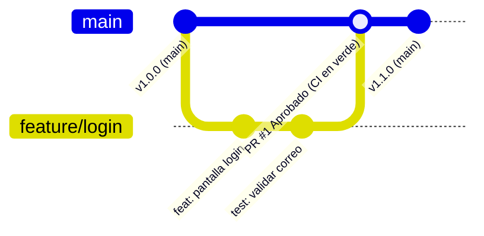

# Guía de Contribución y Reglas de Trabajo en Equipo - LoginApp 🦷📱

¡Bienvenido(a) al equipo de desarrollo de **LoginApp** para la Clínica Dental Sonrisas!

Para asegurar la calidad del código, la estabilidad de la rama principal (`main`) y el correcto funcionamiento del pipeline de Integración Continua (CI), todos los miembros del equipo deben seguir estas reglas de colaboración.

---

## 📋 1. Modelo de Trabajo: GitHub Flow

Adoptamos **GitHub Flow** como modelo de ramificación por ser ágil, centrado en ramas cortas y enfocado en integración continua con despliegue confiable.

### Diagrama del Flujo de Trabajo



### Pasos del Flujo:
1. **Crear una rama descriptiva** a partir de la versión más reciente de `main`.
2. **Realizar commits pequeños y claros** con mensajes estructurados.
3. **Abrir un Pull Request (PR)** hacia `main` usando la plantilla oficial.
4. **Esperar a que GitHub Actions ejecute el CI** (`flutter analyze` y `flutter test`).
5. **Revisión por pares (Code Review)**: Al menos un compañero debe revisar y aprobar el código.
6. **Fusionar en `main`**: Solo cuando las pruebas estén en verde y la aprobación esté otorgada.

---

## 🌿 2. Convención de Ramas

Toda rama debe seguir el siguiente formato:

| Prefijo | Propósito | Ejemplo |
| :--- | :--- | :--- |
| `feature/` | Nuevas funcionalidades o pantallas | `feature/login` o `feature/validacion-correo` |
| `bugfix/` | Corrección de errores | `bugfix/error-formato-correo` |
| `hotfix/` | Correcciones urgentes para producción | `hotfix/bloqueo-pantalla-inicio` |
| `test/` | Incorporación o mejora de pruebas | `test/pruebas-unitarias-correo` |
| `docs/` | Actualizaciones en documentación | `docs/actualizar-readme` |

> ⚠️ **Regla Estricta**: Nadie tiene permitido hacer `git push` directo a la rama `main`. Todos los cambios deben ingresar a través de un Pull Request.

---

## ✍️ 3. Convención de Mensajes de Commit (Conventional Commits)

Los mensajes de commit deben seguir la especificación estándar:

```plaintext
<tipo>(<alcance>): <descripción breve>

[cuerpo explicativo opcional]
```

### Tipos:
- `feat`: Nueva característica para el usuario (ej: `feat(login): agregar pantalla de inicio de sesión con Flutter`).
- `fix`: Corrección de un fallo (ej: `fix(validacion): permitir dominios modernos en validarCorreo`).
- `test`: Añadir o modificar pruebas automáticas (ej: `test(correo): agregar pruebas para correos sin arroba`).
- `docs`: Modificaciones en documentación (ej: `docs: agregar guía de contribución en CONTRIBUTING.md`).
- `refactor`: Refactorización de código sin alterar funcionalidad.
- `chore`: Tareas de mantenimiento o configuración (ej: `chore: configurar flutter en ci.yml`).

---

## 🧪 4. Pruebas Automáticas y Verificación Local

Antes de enviar cualquier commit o abrir un Pull Request, debes verificar que tu código compila y pasa todas las pruebas localmente:

```bash
# 1. Obtener dependencias
flutter pub get

# 2. Análisis estático (cero errores o advertencias)
flutter analyze

# 3. Ejecutar las pruebas unitarias
flutter test
```

---

## 🔍 5. Proceso de Pull Request (PR) y Code Review

1. Al abrir tu PR en GitHub, completa los campos solicitados por la plantilla `.github/pull_request_template.md`.
2. Asigna al menos a **un compañero de equipo** como revisor (*Reviewer*).
3. El revisor debe validar:
   - Que el código sea legible y siga buenas prácticas de Flutter.
   - Que las pruebas unitarias cubran los casos válidos e inválidos.
   - Que el bot de GitHub Actions muestre la **palomita verde (Checks passed)**.
4. Una vez aprobado, se realiza el *Merge* hacia `main`.

---

## 🏷️ 6. Versionado Semántico (SemVer)

Seguimos el estándar **SemVer 2.0.0** (`MAJOR.MINOR.PATCH`):
- **MAJOR (ej. 2.0.0)**: Cambios incompatibles o reestructuraciones totales de la app.
- **MINOR (ej. 1.1.0)**: Nuevas funciones compatibles con versiones anteriores (ej. nueva pantalla o feature flag).
- **PATCH (ej. 1.0.1)**: Correcciones de bugs menores.

---

## 📱 7. Política de Feature Flags (Demostración de Despliegue)

Para funciones en etapa experimental o despliegue escalonado (como el Carnet Digital QR):
- Deben estar condicionadas bajo una bandera booleana (ej. `kHabilitarCarnetQR`).
- Esto permite desactivar la funcionalidad al instante sin necesidad de un rollback destructivo si se detecta un incidente en producción.
